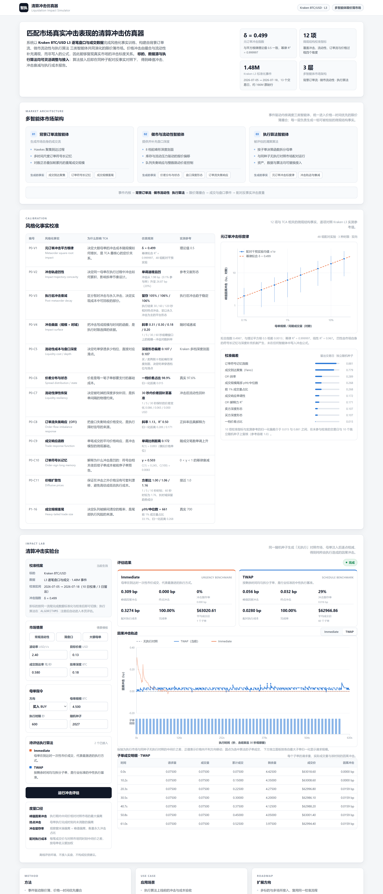

# Liquidation Impact Simulator

An event-driven limit-order-book simulator that **matches the real market's impact
behaviour**, built so that any liquidation algorithm can be plugged in and measured.

The market is trained on Kraken BTC/USD L3 tick data against the microstructure facts
that generate execution cost, then three agent layers — background order flow,
market-making liquidity, and the execution algorithm — evolve together on one order
book. Asset, data source, and execution algorithm are all interchangeable.

> Offline evaluation environment. It does not connect to live venues and is not
> investment advice.



## Multi-agent market architecture

A priority-queue event kernel schedules every agent on one clock and one order book:

```text
事件驱动内核
  |-- 背景订单流智能体   Hawkes 聚集到达 · 多时间尺度符号长记忆 · 重尾成交规模
  |-- 做市与流动性智能体 8 档驼峰形深度 · 库存与流动压力报价偏移 · 队列失衡响应
  `-- 执行算法智能体     子单决策函数 · 与同种子对照市场配对运行
          |
          v
限价簿撮合（价格—时间优先）-> 成交与盘口事件 -> 配对反事实冲击度量
```

| Agent layer | Mechanisms | Stylized facts it generates |
|---|---|---|
| Background order flow | Hawkes clustered arrivals, multi-timescale sign long memory, lognormal + Pareto sizes | arrival clustering, order-sign memory, heavy-tailed size |
| Market making & liquidity | 8-level hump-shaped depth, inventory and flow-pressure quote skew, queue-imbalance response | spread distribution, depth shape, OFI response |
| Execution algorithm | child-order decision function, paired against a same-seeded control market | metaorder impact scaling, impact trajectory and decay |

**No agent contains an impact formula.** The concave, square-root-like scaling emerges
from the interaction of these mechanisms — which is why it extrapolates to algorithms
and parent sizes the training never saw.

## Calibration

| | |
|---|---|
| Venue and data | Kraken BTC/USD L3 tick book and trades, 2026-07-05 → 2026-07-18 |
| Scale | ~166M raw rows → 1.48M canonical events over 13 sessions |
| Training split | 10 sessions train, 3 untouched sessions plus 10 independent seeds re-check |
| Search | 80 Optuna TPE trials over the multi-agent parameter space |
| Metaorder impact | δ = 0.4987 against the theoretical 0.5, power-law R² = 0.999997 |
| Calibration deviation | 10 target metrics, normalized deviation 0.015 – 0.881 (reference tolerance 1.0) |

The single served artifact behind every number is
[`outputs/latest_p0p1/stylized_facts.json`](outputs/latest_p0p1/stylized_facts.json),
generated by [`scripts/build_stylized_fact_evidence.py`](scripts/build_stylized_fact_evidence.py).
The web app, the PDF and the slide deck all render from it, so they cannot drift apart.

### Stylized facts and their measured values

| ID | Fact | Simulated | Reference |
|---|---|---|---|
| P0-V1 | Metaorder square-root impact | δ = 0.499, power R² = 0.999997 | theoretical 0.5 |
| P0-V2 | Impact trajectory concavity | 1.98 bp at 0.1% → 26.87 bp at 20% participation | monotone and concave |
| P0-V3 | Post-metaorder decay | retention 105% / 106% / 106% at 30 / 60 / 120 s | impact settles after execution |
| P0-V4 | Impact surface | size slopes 0.31 / 0.30 / 0.18 / 0.20 at 1/5/30/60 s | decreasing with horizon |
| P0-C5 | Liquidity cost / depth | depth-shape deviation 0.107 / 0.107 | Kraken multi-level depth profile |
| P0-C6 | Spread distribution / state | one-tick share 98.9% | measured 97.6% |
| P0-C7 | Liquidity resiliency | spread back to baseline within 30 s | replenishment after impact |
| P0-C8 | Order-flow-imbalance response | slope 1.13, R² 0.50 | positive slope with explanatory power |
| P0-C9 | Trade response function | monotonicity deviation 0.172 | monotone in trade count |
| P0-C10 | Order-sign long memory | γ = 0.503 | power-law decay, 0 < γ < 1 |
| P0-C11 | Diffusive prices | variance ratios 1.00 / 1.06 / 1.16 at 1/5/10 s | close to 1.0 |
| P1-16 | Heavy-tailed trade size | p99/median = 661 | measured 700 |

Values come from [`outputs/latest_p0p1/stylized_facts.json`](outputs/latest_p0p1/stylized_facts.json),
generated by [`scripts/build_stylized_fact_evidence.py`](scripts/build_stylized_fact_evidence.py).
The web app serves it at `/api/stylized-facts` and the submission materials render from
the same file, so they cannot drift apart.

## How impact is measured

Every run is a paired counterfactual under common random numbers:

1. Simulate the market with the given seed and **no execution** — this is the control.
2. Simulate the identical market with the parent order injected.
3. Interpolate both midpoint paths onto one regular time grid and subtract pointwise.

What remains is the price move caused by the execution and nothing else — not the
market's own drift, not quote noise. From that difference the simulator reports:

| Metric | Definition |
|---|---|
| Peak causal impact | largest deviation from the control during execution (bp) |
| Terminal impact | deviation still standing when the parent completes (bp) |
| Impact retention | deviation 30 s after completion ÷ peak, i.e. the permanent share |
| Paired execution cost | each fill price versus the control midpoint at that instant, weighted by parent notional (bp) |

## Plugging in a liquidation algorithm

Algorithms are agents, not special cases. Implement a child-order decision function and
register it:

```python
# liquidation/agents.py
class MyExecutionAgent(ExecutionAgent):
    def desired_quantity(self, kernel, step):
        state = kernel.exchange.book.state()
        return min(self.remaining, ...)      # your schedule

# liquidation/runner.py -> add a branch in make_agent
# app/main.py -> add {"key": "mine", "label": "MyAlgo", ...} to ALGORITHMS
```

It then flows through the same paired measurement, the same charts and the same API
response as the shipped benchmarks.

The application ships **Immediate** (submit the whole parent at arrival), **TWAP**
(uniform remaining-quantity slicing), and **Adaptive** (a liquidity-aware policy
using remaining time, spread, displayed depth, imbalance, and an observable regime
schedule). The UI compares all three on the same seeded market and exposes the
selected algorithm's child orders, impact trajectory, decay, completion, and paired
execution cost. `liquidation/agents.py` additionally contains POV/depth, front-loaded,
and tabular-RL agents for offline experiments.

## Data

Kraken BTC/USD L3 order and trade data covering July 5-13 and July 15-18, 2026. July 14
was corrupt and quarantined. 166,008,529 usable raw rows preprocess into 1,480,003 canonical
events (568,932 trades, 911,071 sampled quote states) across 13 sessions.

Large local data files are excluded from Git. To use your own data, place Parquet files
in `data/raw/btc/` and run:

```powershell
python scripts/reorganize_data.py
python scripts/analyze_real_data.py
```

## Web application and API

In VS Code, open [`app/run_app.py`](app/run_app.py) and click **Run Python File** using
the interpreter that has the project dependencies installed. The launcher resolves the
project directory, starts the server, waits until it is ready, and opens the browser.
On this development machine, Python 3.12 is the verified environment:

```powershell
& "C:\Users\kai\AppData\Local\Programs\Python\Python312\python.exe" app/run_app.py
```

For a fresh environment, install dependencies first and then launch the app:

```powershell
python -m pip install -r requirements.txt
python app/run_app.py
```

The UI opens at <http://127.0.0.1:8000>. If port 8000 is already occupied, stop the
existing simulator process before launching a new one; `/api/health` reports the active
`build_id` and registered algorithms so stale servers are easy to identify.

The page has three parts: the multi-agent market architecture; the calibration results,
where each stylized fact's simulated observation sits beside its Kraken L3 reference
value, together with the impact scaling law and the calibration deviations; and the
impact lab, where you set a market regime and a parent order, run the evaluation, and
compare each registered algorithm's impact path, decay and cost on one seeded market.

If the page loads but running an evaluation fails, a server from an earlier session is
almost certainly still holding port 8000: the browser re-reads `index.html` and `app.js`
from disk every time, while `/api` is still answered by the older process, so the two
contracts disagree. The page shows a red banner and disables the run button in that case,
and `run_app.py` compares `build_id` on startup and prints the PID to stop.

```http
GET  /api/health
GET  /api/algorithms       # registered liquidation algorithms
GET  /api/stylized-facts   # calibration and held-out validation evidence
POST /api/jobs             # run one impact experiment
GET  /api/jobs/{job_id}    # poll progress and result
```

Example request:

```json
{
  "side": "BUY",
  "parent_quantity": 4.5,
  "duration_seconds": 600,
  "volatility": 2.4,
  "spread": 0.13,
  "arrival_rate": 0.58,
  "displayed_depth": 0.18,
  "seed": 2027
}
```

## Reproduction

```powershell
python -m unittest discover -s tests -v
python calibration/calibrate.py
python scripts/validate_simulator.py
python scripts/run_liquidation_experiments.py --config config/default.yaml --output-dir outputs/latest_p0p1/liquidation --strategies twap
python scripts/analyze_liquidation.py --input-dir outputs/latest_p0p1/liquidation --output-dir outputs/latest_p0p1/liquidation/analysis
python scripts/build_stylized_fact_evidence.py
python scripts/make_submission_figures.py
python scripts/generate_competition_assets.py
```

## Repository layout

```text
app/                  FastAPI service, algorithm registry and browser interface
agents/               background market participants
analytics/            stylized facts, scaling, and plots
calibration/          objective and TPE search
config/               data split and simulation defaults
data_processing/      canonical data pipeline and trade signing
liquidation/          liquidation algorithms and the paired-market runner
market/               kernel, exchange, orders, and order book
scripts/              experiments, evidence build and submission assets
submission/           competition deliverables, generated from the evidence file
tests/                unit and service-level tests
outputs/latest_p0p1/  calibration, validation, intervention and diagnosis artifacts
```

## Tests and limitations

27 tests cover order-book priority, exchange fills, deterministic simulation, analytics,
calibration leakage, liquidation timing and completion, causal midpoint handling, the
paired impact summary, request validation, and the evidence artifact's own integrity.
Two of them guard the paired measurement specifically: a parent order too small to move
any price must measure as exactly zero impact, and urgent execution must peak above a
schedule on every shipped scenario.

Scope: metaorder impact is measured through synthetic intervention experiments — with
real parent-order labels the same pipeline supports an in-sample empirical comparison.
Price diffusivity retains some trend at horizons beyond 60 seconds (variance ratio 1.76),
reported as measured. Execution is market-order only; fees, funding, latency arbitration
and cross-venue routing are not modelled.

## License and data

Add an explicit license before public redistribution if required. Market data are not
included; users are responsible for data licensing and exchange terms.
