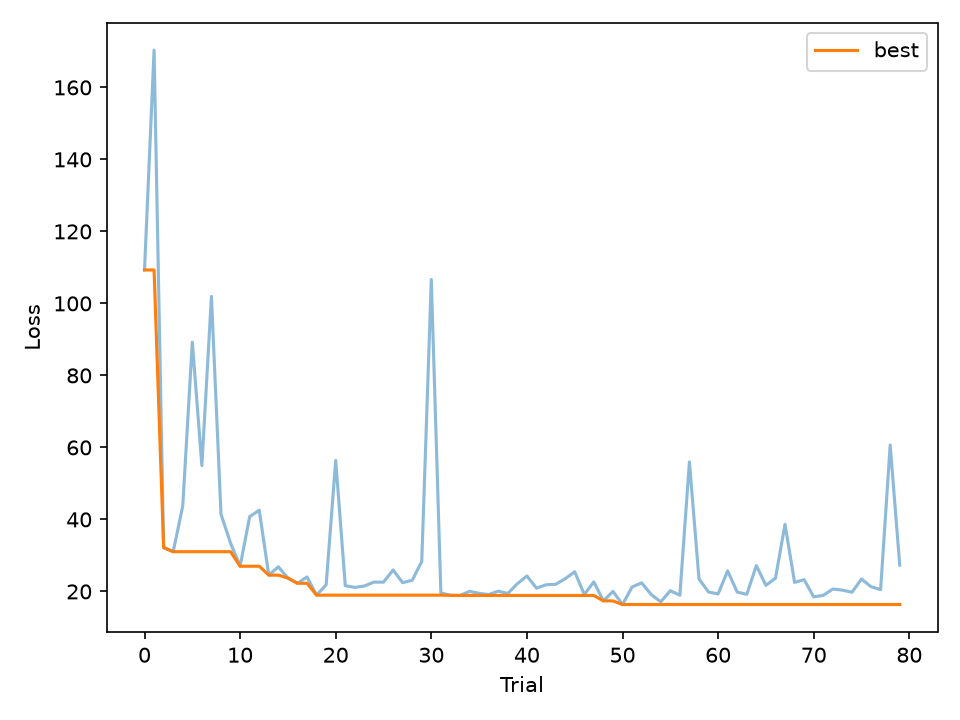
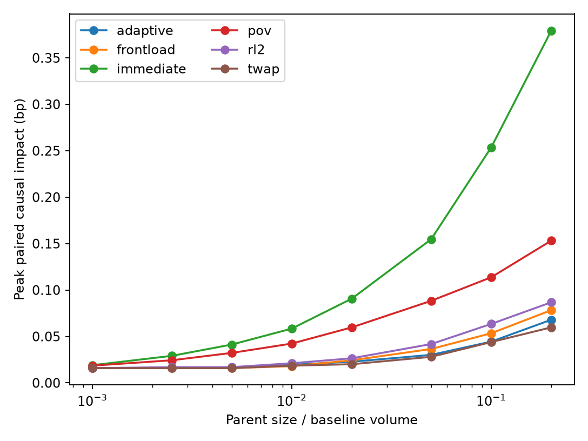
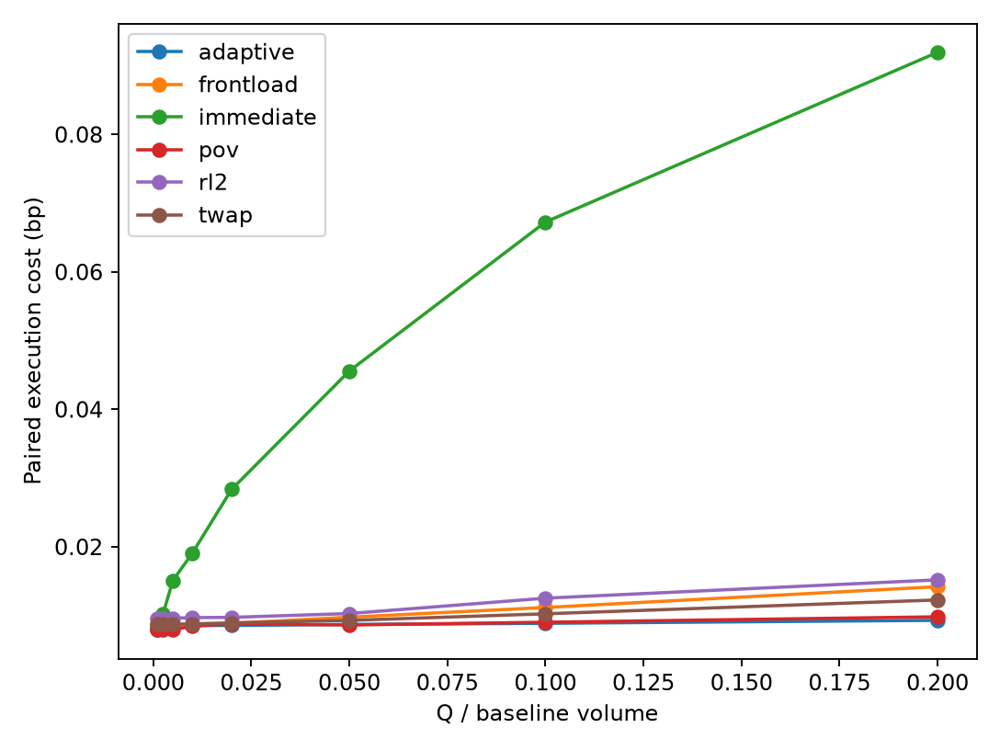

# Agent Simulator: BTC Market Microstructure and Execution

An interpretable, event-driven BTC/USD limit-order-book simulator for market-microstructure research and transaction cost analysis (TCA). The project calibrates a reactive background market to public L3 trade and quote data, injects controlled liquidation agents, measures causal market impact against paired controls, and exposes execution policies through a web application and API.

> Research status: the refined simulator reproduces several important held-out facts and generates concave, square-root-like synthetic metaorder impact, but it does **not** pass every strict validation gate. Results are research estimates, not production trading advice.

## Highlights

- Price-time-priority continuous double auction with a discrete-event kernel.
- Thirteen usable BTC sessions and 166 million raw rows summarized into a canonical 1.48 million-event analytical dataset.
- Chronological split: ten calibration sessions and three untouched validation sessions.
- Optuna TPE simulated-minimum-distance calibration using three seeds per trial.
- Public-data targets: spreads, depth, trade sizes, interarrival times, sign autocorrelation, event/clock response, signed-flow impact, and one-second volatility.
- Paired common-random-number experiments isolate each liquidation agent's causal cost and impact.
- Immediate, TWAP, POV/depth, front-loaded, adaptive, and tuned tabular-RL execution policies.
- FastAPI application with asynchronous jobs, progress feedback, execution instructions, and a trader-facing cumulative path chart.

## Data

The local study used BTC L3 order/trade data covering July 5-13 and July 15-18, 2026. July 14 was corrupt and quarantined. Raw data contain 166,008,529 usable rows (approximately 4.6 GB). Preprocessing creates `data/processed/events.parquet` with 568,932 trades, 911,071 sampled quote states, and a retained session `date`.

Large local data files are excluded from Git. To use your own data, place Parquet files in `data/raw/btc/` and run:

```powershell
python scripts/reorganize_data.py
python scripts/analyze_real_data.py
```

The canonical schema includes nanosecond timestamp, event type, aggressor side, price, size, best bid/ask, best-level depth, midpoint, spread, sign provenance, and session date.

## Simulator architecture

```text
Kernel (priority-queue event clock)
  |-- Market maker: multi-level quotes and reactive liquidity
  |-- Order flow: clustered arrivals, heavy-tailed size, persistent signs
  `-- Execution agent: parent-order child instructions
          |
          v
Exchange -> price-time-priority order book -> trades and book-state events
```

The order-flow agent generates rate-preserving burst/regular interarrivals, lognormal sizes, and persistent BUY/SELL regimes. The market maker maintains eight levels and reacts anonymously to all aggressive flow through stochastic reference-price innovation, decaying inventory pressure, concave signed-flow response, flow-dependent spread widening, and asymmetric opposite-side liquidity. Impact is not hard-coded by agent identity.

## Calibration and validation

Calibration uses the first ten sessions only. Each of 80 Optuna TPE candidates is evaluated on three independent one-hour simulations. Curve distances interpolate observations onto a shared size/flow domain rather than matching unrelated quantile-bin indices. Volatility is measured using one-second log-midpoint returns in basis points.

The refined best candidate is trial 50 with corrected-objective loss 16.365. On ten new seeds against three held-out sessions:



| Diagnostic | Refined result |
|---|---:|
| Simulated response R(1) | $0.049 |
| Held-out response R(1) | $0.067 |
| Physical-time response distance | 0.962 |
| One-second volatility relative error | 4.1% |
| Trade-rate relative error | 17.8% |
| Bid/ask depth distances | 0.316 / 0.348 |

The strict gate still fails trade-size distribution (1.387), event-time response (1.545), size impact (2.623), and signed-flow impact (2.293). This limitation must accompany any TCA interpretation. Artifacts are in `outputs/calibration/` and `outputs/validation/`.

## Synthetic metaorders and scaling law

The intervention study uses paired runs across BUY/SELL, 120/300/600-second deadlines, five seeds, and parent sizes from 0.1% to 20% of contemporaneous volume. The control uses the identical random market path.

The smallest orders lie on the one-tick floor. Over the identifiable region `Q/V >= 1%`:

| Strategy | Exponent delta | 95% seed-bootstrap CI | R2 |
|---|---:|---:|---:|
| POV/depth | 0.423 | [0.406, 0.441] | 0.998 |
| Tuned RL (scaling run) | 0.489 | [0.438, 0.541] | 0.988 |
| TWAP | 0.410 | [0.384, 0.442] | 0.970 |

The RL exponent is statistically consistent with the square-root benchmark of 0.5. This demonstrates endogenous concavity, not external validation of absolute costs without real parent-order labels.

The plot below extends the original liquidation-impact figure to all current policies, including Immediate, Front-loaded, Adaptive, and tuned RL2.



## Execution algorithms

Policies are compared on the same market seeds, side, parent size, start state, and deadline. Primary cost compares each fill with the paired control midpoint at the same timestamp. Unfilled inventory receives a 5 bp penalty.

| Rank | Policy | Paired cost (bp) | Penalized cost (bp) | Completion |
|---:|---|---:|---:|---:|
| 1 | POV/depth | 0.00856 | 0.00856 | 100% |
| 2 | Adaptive | 0.00870 | 0.00870 | 100% |
| 3 | TWAP | 0.00947 | 0.00947 | 100% |
| 4 | Front-loaded | 0.00980 | 0.00980 | 100% |
| 5 | Tuned RL2 | 0.01077 | 0.01077 | 100% |
| 6 | Immediate | 0.03569 | 0.07220 | 99.27% average |

Immediate submits the entire parent at arrival and is the worst urgency benchmark. Its minimum completion is 33.17% because a one-shot market order cannot wait for replenishment.



POV has the lowest mean cost; Adaptive has nearly the same mean and the smallest dispersion. Their difference is not statistically resolved. Adaptive is the stable, explainable application-facing default; RL remains experimental.

- **Immediate:** request all inventory at the start.
- **TWAP:** request `remaining quantity / remaining decisions`.
- **POV/depth:** request the larger of 25% schedule pressure and 50% of opposite best-level depth.
- **Front-loaded:** exponentially declining deterministic child quantities.
- **Adaptive:** adjusts schedule for deadline urgency, spread, side-adjusted imbalance, and opposite depth, with terminal catch-up.
- **RL2:** observes time, inventory, spread, side-adjusted imbalance, depth/schedule ratio, and side-adjusted momentum; selects `{0.5, 0.75, 1, 1.5, 2}` times schedule quantity and forces terminal catch-up.

Results and plots are under `outputs/execution_algorithms/comparison/` and `outputs/liquidation/`.

## Web application and API

On Windows, double-click [`app/Run BTC Simulator.bat`](app/Run%20BTC%20Simulator.bat). It checks the required packages, opens the application in the default browser, and keeps a console window available for stopping the server with `Ctrl+C`.

Alternatively, start it from a terminal:

```powershell
python -m pip install -r requirements.txt
python -m uvicorn app.main:app --host 127.0.0.1 --port 8000
```

Open `http://127.0.0.1:8000`.

The interface accepts side, parent quantity, deadline, volatility, spread, trade-arrival rate, displayed depth, and seed. Defaults are rounded versions of the calibrated BTC market. Each asynchronous job evaluates Immediate, TWAP, and Adaptive on the same seeded market path. The page compares estimated causal impact, execution cost, and completion, then presents only the recommended Adaptive child-order schedule. A progress bar reports each simulation phase.

API routes:

```http
GET  /api/health
POST /api/jobs
GET  /api/jobs/{job_id}
```

Example request:

```json
{
  "side": "SELL",
  "parent_quantity": 1.0,
  "duration_seconds": 300,
  "volatility": 2.02,
  "spread": 0.10,
  "arrival_rate": 0.536,
  "displayed_depth": 0.30,
  "seed": 2026
}
```

For one tuned-RL instruction without the server, run `python scripts/generate_execution_instruction.py --help`.

## Reproduction

```powershell
python -m unittest discover -s tests -v
python calibration/calibrate.py
python scripts/validate_simulator.py
python scripts/train_rl_execution.py --config outputs/calibration/best_config.yaml --strategy rl2 --episodes 1200 --output-dir outputs/execution_algorithms/rl2_tuned
python scripts/run_liquidation_experiments.py --config outputs/calibration/best_config.yaml --q-table outputs/execution_algorithms/rl2_tuned/q_table.json --output-dir outputs/execution_algorithms/benchmark --strategies immediate twap pov frontload adaptive rl2
python scripts/analyze_liquidation.py --input-dir outputs/execution_algorithms/benchmark --output-dir outputs/execution_algorithms/benchmark/comparison
python scripts/compare_execution_algorithms.py
```

## Repository layout

```text
app/                  FastAPI service and browser interface
agents/               background market participants
analytics/            stylized facts, scaling, and plots
calibration/          objective and TPE search
config/               data split and simulation defaults
data_processing/      canonical data pipeline and trade signing
liquidation/          execution policies and paired-market runner
market/               kernel, exchange, orders, and order book
scripts/              experiments and application utilities
tests/                unit and service-level tests
outputs/               compact final evidence; local legacy is ignored
```

## Tests and limitations

Twenty tests cover order-book priority, exchange fills, deterministic simulation, analytics, leakage, calibration, liquidation timing/completion, causal midpoint handling, policy instructions, request validation, and application execution paths.

Known limitations include no proprietary metaorder labels, a compact participant population, synthetic multi-level liquidity, market-order execution only, a failed strict held-out response/impact gate, and no fees, funding, venue routing, live connectivity, or latency arbitration.

## License and data

Add an explicit license before public redistribution if required. Market data are not included; users are responsible for data licensing and exchange terms.
